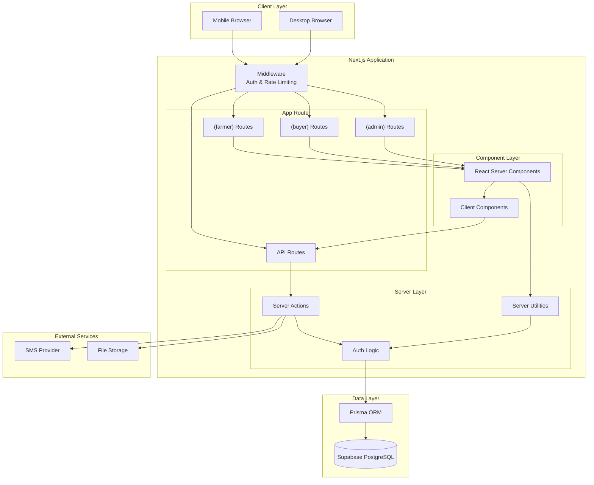

# Design Document: Platform Architecture Foundation

## Overview

The Kulima Platform Architecture Foundation establishes the production-grade technical infrastructure for an enterprise agriculture platform serving East African farmers, buyers, and administrators. This design implements a scalable, secure, and maintainable foundation using Next.js 14 App Router, TypeScript, Prisma ORM, and Supabase PostgreSQL.

### Design Goals

1. **Production-Grade Architecture**: Enterprise-ready patterns suitable for financial transactions and thousands of users
2. **Long-Term Maintainability**: Clear separation of concerns, modular design, and comprehensive type safety
3. **Database Integrity**: Safe migration strategies, audit trails, and data consistency guarantees
4. **Mobile-First Performance**: Optimized for low-bandwidth East African infrastructure and low-end Android devices
5. **Security-First Approach**: Fintech-grade security with role-based access control and defense-in-depth
6. **Future Scalability**: Architecture prepared for multi-region deployment, queuing systems, and marketplace growth

### Technology Stack

- **Framework**: Next.js 14 App Router with React Server Components
- **Language**: TypeScript (strict mode)
- **Database**: Supabase PostgreSQL with Prisma ORM
- **Styling**: TailwindCSS with mobile-first design tokens
- **State Management**: TanStack Query (server state) + Zustand (client state)
- **Validation**: Zod schemas with type inference
- **Deployment**: Vercel with serverless functions

### Key Architectural Principles

1. **Server-First Architecture**: Leverage React Server Components for data fetching and reduced client bundle size
2. **Type Safety Everywhere**: End-to-end type safety from database to UI components
3. **Zero Trust Security**: Validate and authorize at every layer (middleware, API routes, Server Actions)
4. **Explicit Over Implicit**: Clear boundaries between server and client code
5. **Progressive Enhancement**: Core functionality works without JavaScript where possible
6. **Fail Fast**: Validate configuration and environment at startup

## Architecture

### System Architecture Diagram



### Folder Structure

```
kulima-platform/
├── prisma/
│   ├── schema.prisma
│   ├── migrations/
│   └── seed.ts
├── src/
│   ├── app/
│   │   ├── (farmer)/
│   │   ├── (buyer)/
│   │   ├── (admin)/
│   │   ├── api/
│   │   ├── layout.tsx
│   │   └── page.tsx
│   ├── components/
│   │   ├── ui/
│   │   ├── features/
│   │   └── layouts/
│   ├── lib/
│   │   ├── api/
│   │   ├── validations/
│   │   ├── utils.ts
│   │   └── env.ts
│   ├── server/
│   │   ├── db.ts
│   │   ├── auth.ts
│   │   └── services/
│   └── types/
├── public/
├── .env.example
├── next.config.js
├── tailwind.config.ts
├── tsconfig.json
└── package.json
```

## Components and Interfaces

### Database Connection Layer

Singleton Prisma Client prevents connection pool exhaustion in development and production.

### Environment Configuration

Zod-validated environment variables with fail-fast startup validation.

### API Response Utilities

Standardized response formats for consistent error handling across all endpoints.

### Validation Architecture

Reusable Zod schemas with TypeScript type inference for all input validation.

### Authentication Architecture

JWT-based sessions with role-based access control enforced at middleware and server action layers.

### Error Handling

Centralized error translation with user-friendly messages and comprehensive server-side logging.

## Data Models

### Database Schema Overview

The schema includes 10 core models supporting the agricultural platform:

1. **User**: Authentication and role management
2. **Farmer**: Farmer profile and farm ownership
3. **Buyer**: Buyer profile and business information
4. **Farm**: Farm location and size tracking
5. **CropCycle**: Crop planting and harvest tracking
6. **Listing**: Produce listings for marketplace
7. **Offer**: Buyer offers on listings
8. **Notification**: Multi-channel notification system
9. **MarketPrice**: Historical market price data
10. **LoanProfile**: Farmer loan tracking

### Key Schema Features

- **Audit Timestamps**: All models include createdAt and updatedAt
- **Soft Deletes**: Critical models support soft deletion for data retention
- **Cascading Deletes**: Proper cascade rules prevent orphaned records
- **Indexes**: Strategic indexes on foreign keys and query-heavy fields
- **Enums**: Type-safe status and role enumerations


## Production Architecture Considerations

### 1. Safe Prisma Migration Strategy

**Expand and Contract Pattern**:

The platform uses the expand-and-contract pattern for zero-downtime schema changes:

1. **Expand Phase**: Add new columns/tables without removing old ones
2. **Deploy Application**: Update code to write to both old and new schema
3. **Migrate Data**: Backfill data from old to new schema
4. **Contract Phase**: Remove old columns/tables after verification

**Migration Naming Convention**:

```
YYYYMMDDHHMMSS_descriptive_name
20250115120000_add_farmer_phone_number
20250115130000_backfill_farmer_phone_numbers
20250115140000_remove_old_phone_column
```

**Non-Destructive Migration Rules**:

- Never use `DROP COLUMN` in production migrations without data migration
- Always add columns as nullable first, then backfill, then add NOT NULL constraint
- Use `ALTER TABLE ... RENAME COLUMN` instead of drop/add for renames
- Review generated SQL before applying migrations
- Test migrations on production-like data volumes

**Database Reset Protection**:

```json
// package.json
{
  "scripts": {
    "db:migrate": "prisma migrate deploy",
    "db:migrate:dev": "prisma migrate dev",
    "db:reset": "echo 'Use db:reset:dev for development only' && exit 1",
    "db:reset:dev": "prisma migrate reset"
  }
}
```

### 2. Authentication Architecture Details

**Session Security**:

- JWT tokens signed with HS256 algorithm
- 7-day session expiration with automatic renewal
- HttpOnly cookies prevent XSS attacks
- Secure flag in production enforces HTTPS
- SameSite=Lax prevents CSRF attacks

**Authorization Layers**:

1. **Middleware Layer**: First line of defense, checks authentication and role-based route access
2. **Server Action Layer**: Re-validates authentication before executing business logic
3. **Database Layer**: Row-level security policies (future enhancement)

**Protected Route Strategy**:

```typescript
// Route group structure enforces separation
(farmer)/     // Only accessible by FARMER role
(buyer)/      // Only accessible by BUYER role
(admin)/      // Only accessible by ADMIN role
```

**Password Security**:

- Minimum 8 characters (enforced by validation)
- Hashed with bcrypt (cost factor 12)
- Never logged or exposed in error messages
- Password reset requires email verification

### 3. Production Logging Architecture

**Structured Logging**:

```typescript
// src/lib/logger.ts
type LogLevel = 'info' | 'warn' | 'error' | 'debug'

type LogContext = {
  userId?: string
  requestId?: string
  path?: string
  method?: string
  duration?: number
  [key: string]: unknown
}

export function log(level: LogLevel, message: string, context?: LogContext) {
  const timestamp = new Date().toISOString()
  const logEntry = {
    timestamp,
    level,
    message,
    ...context,
    environment: process.env.NODE_ENV,
  }
  
  if (process.env.NODE_ENV === 'production') {
    // JSON format for log aggregation services
    console.log(JSON.stringify(logEntry))
  } else {
    // Human-readable format for development
    console.log(`[${timestamp}] ${level.toUpperCase()}: ${message}`, context)
  }
}
```

**Error Tracking Strategy**:

- All API errors logged with full context
- User-facing errors sanitized to prevent information leakage
- Error codes enable client-side error handling
- Request IDs enable tracing across services

**API Monitoring Preparation**:

- Response time logging for performance tracking
- Error rate monitoring by endpoint
- Request volume tracking for capacity planning
- Structured logs ready for aggregation services (Datadog, LogRocket, Sentry)

### 4. Scalable State Management Boundaries

**Server State (TanStack Query)**:

Use TanStack Query for:
- Data fetched from API endpoints
- User profiles, farms, listings, offers
- Market prices and notifications
- Any data that originates from the database

```typescript
// Example: Fetching farmer listings
import { useQuery } from '@tanstack/react-query'

export function useListings(farmerId: string) {
  return useQuery({
    queryKey: ['listings', farmerId],
    queryFn: () => fetch(`/api/listings?farmerId=${farmerId}`).then(r => r.json()),
    staleTime: 5 * 60 * 1000, // 5 minutes
    cacheTime: 10 * 60 * 1000, // 10 minutes
  })
}
```

**Client State (Zustand)**:

Use Zustand for:
- UI state (modals, sidebars, tabs)
- Form state (multi-step forms)
- Temporary selections (filters, sorting)
- User preferences (theme, language)

```typescript
// Example: UI state management
import { create } from 'zustand'

type UIStore = {
  isSidebarOpen: boolean
  toggleSidebar: () => void
}

export const useUIStore = create<UIStore>((set) => ({
  isSidebarOpen: false,
  toggleSidebar: () => set((state) => ({ isSidebarOpen: !state.isSidebarOpen })),
}))
```

**State Management Rules**:

- Never duplicate server state in Zustand
- Use TanStack Query for all API data
- Use Zustand only for ephemeral UI state
- Avoid global state for component-specific state

### 5. API Architecture Standards

**Feature-Based Route Organization**:

```
src/app/api/
├── auth/
│   ├── register/route.ts
│   ├── login/route.ts
│   └── logout/route.ts
├── farmers/
│   ├── route.ts              # GET /api/farmers, POST /api/farmers
│   └── [id]/
│       ├── route.ts          # GET /api/farmers/:id, PATCH /api/farmers/:id
│       └── farms/route.ts    # GET /api/farmers/:id/farms
├── listings/
│   ├── route.ts
│   └── [id]/
│       ├── route.ts
│       └── offers/route.ts
└── market-prices/
    └── route.ts
```

**Rate Limiting Preparation**:

```typescript
// src/lib/api/rate-limit.ts
import { LRUCache } from 'lru-cache'

type RateLimitOptions = {
  interval: number  // Time window in milliseconds
  uniqueTokenPerInterval: number  // Max unique tokens
}

export function rateLimit(options: RateLimitOptions) {
  const tokenCache = new LRUCache({
    max: options.uniqueTokenPerInterval,
    ttl: options.interval,
  })

  return {
    check: (limit: number, token: string) => {
      const tokenCount = (tokenCache.get(token) as number[]) || [0]
      if (tokenCount[0] === 0) {
        tokenCache.set(token, [1])
      }
      tokenCount[0] += 1

      const currentUsage = tokenCount[0]
      const isRateLimited = currentUsage >= limit

      return { isRateLimited, remaining: limit - currentUsage }
    },
  }
}

// Usage in API route
const limiter = rateLimit({
  interval: 60 * 1000, // 1 minute
  uniqueTokenPerInterval: 500,
})

export async function POST(request: Request) {
  const ip = request.headers.get('x-forwarded-for') ?? 'anonymous'
  const { isRateLimited } = limiter.check(10, ip) // 10 requests per minute

  if (isRateLimited) {
    return errorResponse('Too many requests', 429, 'RATE_LIMIT_EXCEEDED')
  }

  // Handle request
}
```

**Typed API Contracts**:

```typescript
// src/types/api.ts
export type ApiEndpoint<TInput, TOutput> = {
  input: TInput
  output: TOutput
}

export type ListingsEndpoints = {
  'GET /api/listings': ApiEndpoint<
    { farmerId?: string; status?: string },
    { listings: Listing[] }
  >
  'POST /api/listings': ApiEndpoint<
    CreateListingInput,
    { listing: Listing }
  >
  'GET /api/listings/:id': ApiEndpoint<
    { id: string },
    { listing: Listing }
  >
}
```

**Pagination Standards**:

```typescript
// Standard pagination parameters
type PaginationParams = {
  page: number      // 1-indexed
  pageSize: number  // Default 20, max 100
}

type PaginatedResponse<T> = {
  data: T[]
  pagination: {
    page: number
    pageSize: number
    totalCount: number
    totalPages: number
    hasNextPage: boolean
    hasPreviousPage: boolean
  }
}

// Implementation
export async function GET(request: Request) {
  const { searchParams } = new URL(request.url)
  const page = parseInt(searchParams.get('page') ?? '1')
  const pageSize = Math.min(parseInt(searchParams.get('pageSize') ?? '20'), 100)
  
  const skip = (page - 1) * pageSize
  
  const [data, totalCount] = await Promise.all([
    prisma.listing.findMany({ skip, take: pageSize }),
    prisma.listing.count(),
  ])
  
  const totalPages = Math.ceil(totalCount / pageSize)
  
  return successResponse<PaginatedResponse<Listing>>({
    data,
    pagination: {
      page,
      pageSize,
      totalCount,
      totalPages,
      hasNextPage: page < totalPages,
      hasPreviousPage: page > 1,
    },
  })
}
```

### 6. File Upload Architecture

**Secure Upload Validation**:

```typescript
// src/lib/validations/file.ts
import { z } from 'zod'

const MAX_FILE_SIZE = 10 * 1024 * 1024 // 10MB
const ALLOWED_TYPES = ['image/jpeg', 'image/png', 'image/webp']

export const fileUploadSchema = z.object({
  file: z
    .instanceof(File)
    .refine((file) => file.size <= MAX_FILE_SIZE, 'File size must be less than 10MB')
    .refine(
      (file) => ALLOWED_TYPES.includes(file.type),
      'File must be JPEG, PNG, or WebP'
    ),
})

// Additional validation for image dimensions
export async function validateImageDimensions(file: File) {
  return new Promise<{ width: number; height: number }>((resolve, reject) => {
    const img = new Image()
    img.onload = () => resolve({ width: img.width, height: img.height })
    img.onerror = reject
    img.src = URL.createObjectURL(file)
  })
}
```

**Storage Organization Strategy**:

```
uploads/
├── farmers/
│   └── {farmerId}/
│       ├── profile/
│       │   └── avatar.jpg
│       └── farms/
│           └── {farmId}/
│               └── photos/
│                   ├── photo1.jpg
│                   └── photo2.jpg
├── listings/
│   └── {listingId}/
│       ├── main.jpg
│       └── gallery/
│           ├── img1.jpg
│           └── img2.jpg
└── temp/
    └── {uploadId}/
        └── pending.jpg
```

**Future CDN Readiness**:

- Store files with content-based hashing for cache busting
- Generate multiple image sizes on upload (thumbnail, medium, large)
- Use WebP format with JPEG fallback
- Implement lazy loading with blur placeholders
- Prepare for migration to Supabase Storage or Cloudinary

### 7. Database Performance Planning

**Index Strategy**:

```prisma
model Listing {
  id          String   @id @default(cuid())
  farmerId    String
  status      String
  createdAt   DateTime @default(now())
  
  farmer      Farmer   @relation(fields: [farmerId], references: [id])
  
  @@index([farmerId])           // Foreign key index
  @@index([status])             // Filter index
  @@index([createdAt(sort: Desc)]) // Sort index
  @@index([farmerId, status])   // Composite index for common query
}
```

**Query Optimization Guidelines**:

1. **Select Only Needed Fields**:
```typescript
// Bad: Fetches all fields
const users = await prisma.user.findMany()

// Good: Selects specific fields
const users = await prisma.user.findMany({
  select: { id: true, email: true, role: true }
})
```

2. **Use Pagination**:
```typescript
// Always paginate large result sets
const listings = await prisma.listing.findMany({
  take: 20,
  skip: (page - 1) * 20,
})
```

3. **Batch Queries**:
```typescript
// Bad: N+1 query problem
for (const listing of listings) {
  const offers = await prisma.offer.findMany({ where: { listingId: listing.id } })
}

// Good: Single query with include
const listings = await prisma.listing.findMany({
  include: { offers: true }
})
```

**Audit-Ready Timestamps**:

All models include:
- `createdAt`: Record creation timestamp
- `updatedAt`: Last modification timestamp
- `deletedAt`: Soft delete timestamp (where applicable)

**Soft Delete Strategy**:

```prisma
model Listing {
  id        String    @id @default(cuid())
  deletedAt DateTime?
  
  @@index([deletedAt])
}
```

```typescript
// Soft delete implementation
export async function softDelete(id: string) {
  return prisma.listing.update({
    where: { id },
    data: { deletedAt: new Date() },
  })
}

// Query excluding soft-deleted records
export async function findActiveListings() {
  return prisma.listing.findMany({
    where: { deletedAt: null },
  })
}
```

### 8. Future Scalability Preparation

**Multi-Region Readiness**:

- Database connection pooling configured for read replicas
- Stateless authentication enables horizontal scaling
- CDN-ready static asset organization
- API routes designed for edge deployment

**Queue/Job Architecture Preparation**:

```typescript
// src/lib/queue/types.ts
export type JobType = 
  | 'send-sms'
  | 'send-email'
  | 'process-image'
  | 'generate-report'
  | 'sync-market-prices'

export type Job<T = unknown> = {
  id: string
  type: JobType
  payload: T
  attempts: number
  maxAttempts: number
  createdAt: Date
  scheduledFor: Date
}

// Future: Integrate with BullMQ, Inngest, or Trigger.dev
```

**Notification System Extensibility**:

```typescript
// src/server/services/notifications.ts
export interface NotificationProvider {
  send(notification: Notification): Promise<void>
}

export class SMSProvider implements NotificationProvider {
  async send(notification: Notification) {
    // SMS implementation
  }
}

export class EmailProvider implements NotificationProvider {
  async send(notification: Notification) {
    // Email implementation
  }
}

export class PushProvider implements NotificationProvider {
  async send(notification: Notification) {
    // Push notification implementation
  }
}

// Notification service uses strategy pattern
export class NotificationService {
  private providers: Map<NotificationType, NotificationProvider>
  
  async send(notification: Notification) {
    const provider = this.providers.get(notification.type)
    if (!provider) throw new Error(`No provider for ${notification.type}`)
    return provider.send(notification)
  }
}
```

**Marketplace Transaction Scalability**:

- Offer system designed for high-volume bidding
- Optimistic locking prevents race conditions
- Transaction isolation levels configured for financial operations
- Audit trail for all financial transactions

### 9. Mobile Optimization Standards

**Low-Bandwidth Optimization**:

- Server Components reduce JavaScript bundle size
- Critical CSS inlined in HTML
- Images served in modern formats (WebP with JPEG fallback)
- Lazy loading for below-the-fold content
- Compression enabled (Brotli/Gzip)

**Offline-Ready Planning**:

```typescript
// src/app/manifest.ts
import { MetadataRoute } from 'next'

export default function manifest(): MetadataRoute.Manifest {
  return {
    name: 'Kulima Platform',
    short_name: 'Kulima',
    description: 'Agriculture platform for East African farmers',
    start_url: '/',
    display: 'standalone',
    background_color: '#ffffff',
    theme_color: '#10b981',
    icons: [
      {
        src: '/icon-192.png',
        sizes: '192x192',
        type: 'image/png',
      },
      {
        src: '/icon-512.png',
        sizes: '512x512',
        type: 'image/png',
      },
    ],
  }
}
```

**Progressive Enhancement Strategy**:

- Forms work without JavaScript (use Server Actions)
- Critical content rendered server-side
- Client-side enhancements added progressively
- Graceful degradation for older browsers

### 10. Git and Deployment Workflow

**Branching Strategy**:

```
main              # Production branch
├── develop       # Integration branch
├── feature/*     # Feature branches
├── bugfix/*      # Bug fix branches
└── hotfix/*      # Production hotfix branches
```

**CI/CD Preparation**:

```yaml
# .github/workflows/ci.yml (example)
name: CI
on: [push, pull_request]

jobs:
  test:
    runs-on: ubuntu-latest
    steps:
      - uses: actions/checkout@v3
      - uses: actions/setup-node@v3
      - run: npm ci
      - run: npm run lint
      - run: npm run type-check
      - run: npm run test
      - run: npm run build
```

**Environment Separation**:

- Development: Local development with hot reload
- Preview: Vercel preview deployments for PRs
- Staging: Pre-production environment with production-like data
- Production: Live environment with real users

**Preview Deployment Rules**:

- Every PR gets automatic preview deployment
- Preview environments use separate database
- Preview URLs follow pattern: `{branch}-kulima.vercel.app`
- Preview deployments automatically deleted after PR merge

## Error Handling

### Error Handling Strategy

**Layered Error Handling**:

1. **Validation Layer**: Zod schemas catch invalid input before processing
2. **Business Logic Layer**: Custom errors for business rule violations
3. **Database Layer**: Prisma errors translated to user-friendly messages
4. **API Layer**: Standardized error responses with appropriate status codes
5. **UI Layer**: Error boundaries catch rendering errors

**Error Types**:

```typescript
// src/lib/errors.ts
export class AppError extends Error {
  constructor(
    message: string,
    public code: string,
    public statusCode: number,
    public details?: unknown
  ) {
    super(message)
    this.name = 'AppError'
  }
}

export class ValidationError extends AppError {
  constructor(message: string, details?: unknown) {
    super(message, 'VALIDATION_ERROR', 400, details)
  }
}

export class UnauthorizedError extends AppError {
  constructor(message = 'Unauthorized') {
    super(message, 'UNAUTHORIZED', 401)
  }
}

export class ForbiddenError extends AppError {
  constructor(message = 'Forbidden') {
    super(message, 'FORBIDDEN', 403)
  }
}

export class NotFoundError extends AppError {
  constructor(message = 'Resource not found') {
    super(message, 'NOT_FOUND', 404)
  }
}
```

**Error Logging**:

- All errors logged with full context (user ID, request ID, timestamp)
- Sensitive data (passwords, tokens) never logged
- Stack traces logged in development, sanitized in production
- Error aggregation ready for services like Sentry

**User-Facing Error Messages**:

- Clear, actionable error messages
- No technical jargon or stack traces
- Suggest next steps when possible
- Consistent tone and formatting

## Testing Strategy

### Testing Approach

This feature is primarily **infrastructure and configuration setup**, which is not suitable for property-based testing. The testing strategy focuses on:

1. **Configuration Validation Tests**: Verify environment variable validation
2. **Integration Tests**: Test database connections and API endpoints
3. **Unit Tests**: Test utility functions and validation schemas
4. **Manual Testing**: Verify folder structure and deployment configuration

### Test Categories

**1. Environment Configuration Tests**:

```typescript
// src/lib/__tests__/env.test.ts
import { describe, it, expect } from 'vitest'
import { z } from 'zod'

describe('Environment Configuration', () => {
  it('should validate required environment variables', () => {
    const validEnv = {
      DATABASE_URL: 'postgresql://localhost:5432/kulima',
      NEXTAUTH_SECRET: 'a'.repeat(32),
      NEXTAUTH_URL: 'http://localhost:3000',
      NEXT_PUBLIC_SUPABASE_URL: 'https://example.supabase.co',
      NEXT_PUBLIC_SUPABASE_ANON_KEY: 'test-key',
      SMS_PROVIDER_API_KEY: 'test-api-key',
      SMS_PROVIDER_SENDER_ID: 'KULIMA',
    }

    expect(() => envSchema.parse(validEnv)).not.toThrow()
  })

  it('should reject invalid DATABASE_URL', () => {
    const invalidEnv = { ...validEnv, DATABASE_URL: 'not-a-url' }
    expect(() => envSchema.parse(invalidEnv)).toThrow()
  })

  it('should reject short NEXTAUTH_SECRET', () => {
    const invalidEnv = { ...validEnv, NEXTAUTH_SECRET: 'short' }
    expect(() => envSchema.parse(invalidEnv)).toThrow()
  })
})
```

**2. Validation Schema Tests**:

```typescript
// src/lib/validations/__tests__/auth.test.ts
import { describe, it, expect } from 'vitest'
import { registerSchema, loginSchema } from '../auth'

describe('Auth Validation', () => {
  describe('registerSchema', () => {
    it('should accept valid registration data', () => {
      const validData = {
        email: 'farmer@example.com',
        password: 'SecurePass123',
        role: 'FARMER',
        phoneNumber: '+254712345678',
      }
      expect(() => registerSchema.parse(validData)).not.toThrow()
    })

    it('should reject invalid email', () => {
      const invalidData = { ...validData, email: 'not-an-email' }
      expect(() => registerSchema.parse(invalidData)).toThrow()
    })

    it('should reject short password', () => {
      const invalidData = { ...validData, password: 'short' }
      expect(() => registerSchema.parse(invalidData)).toThrow()
    })

    it('should reject invalid phone number format', () => {
      const invalidData = { ...validData, phoneNumber: '0712345678' }
      expect(() => registerSchema.parse(invalidData)).toThrow()
    })
  })
})
```

**3. API Response Utility Tests**:

```typescript
// src/lib/api/__tests__/responses.test.ts
import { describe, it, expect } from 'vitest'
import { successResponse, errorResponse, validationErrorResponse } from '../responses'
import { ZodError } from 'zod'

describe('API Response Utilities', () => {
  it('should create success response', () => {
    const response = successResponse({ id: '123' })
    expect(response.status).toBe(200)
    expect(await response.json()).toEqual({
      success: true,
      data: { id: '123' },
    })
  })

  it('should create error response with status code', () => {
    const response = errorResponse('Not found', 404, 'NOT_FOUND')
    expect(response.status).toBe(404)
    expect(await response.json()).toEqual({
      success: false,
      error: {
        message: 'Not found',
        code: 'NOT_FOUND',
      },
    })
  })
})
```

**4. Database Connection Tests**:

```typescript
// src/server/__tests__/db.test.ts
import { describe, it, expect } from 'vitest'
import { prisma } from '../db'

describe('Database Connection', () => {
  it('should connect to database', async () => {
    await expect(prisma.$connect()).resolves.not.toThrow()
  })

  it('should execute raw query', async () => {
    const result = await prisma.$queryRaw`SELECT 1 as value`
    expect(result).toEqual([{ value: 1 }])
  })
})
```

**5. Authentication Tests**:

```typescript
// src/server/__tests__/auth.test.ts
import { describe, it, expect } from 'vitest'
import { createSession, getSession, requireAuth, requireRole } from '../auth'

describe('Authentication', () => {
  it('should create and retrieve session', async () => {
    const user = { id: '123', email: 'test@example.com', role: 'FARMER' }
    await createSession(user)
    const session = await getSession()
    expect(session).toEqual(user)
  })

  it('should throw error when no session exists', async () => {
    await expect(requireAuth()).rejects.toThrow('Unauthorized')
  })

  it('should throw error when role does not match', async () => {
    const user = { id: '123', email: 'test@example.com', role: 'FARMER' }
    await createSession(user)
    await expect(requireRole(['ADMIN'])).rejects.toThrow('Forbidden')
  })
})
```

**6. Integration Tests**:

```typescript
// src/app/api/__tests__/integration.test.ts
import { describe, it, expect } from 'vitest'
import { POST } from '../auth/register/route'

describe('API Integration Tests', () => {
  it('should register new user', async () => {
    const request = new Request('http://localhost:3000/api/auth/register', {
      method: 'POST',
      body: JSON.stringify({
        email: 'newuser@example.com',
        password: 'SecurePass123',
        role: 'FARMER',
        phoneNumber: '+254712345678',
      }),
    })

    const response = await POST(request)
    expect(response.status).toBe(201)
    const data = await response.json()
    expect(data.success).toBe(true)
  })

  it('should reject duplicate email', async () => {
    // First registration
    await POST(request)
    
    // Duplicate registration
    const response = await POST(request)
    expect(response.status).toBe(409)
    const data = await response.json()
    expect(data.error.code).toBe('DUPLICATE_ENTRY')
  })
})
```

### Test Configuration

```typescript
// vitest.config.ts
import { defineConfig } from 'vitest/config'
import react from '@vitejs/plugin-react'
import path from 'path'

export default defineConfig({
  plugins: [react()],
  test: {
    environment: 'jsdom',
    setupFiles: ['./src/test/setup.ts'],
    coverage: {
      provider: 'v8',
      reporter: ['text', 'json', 'html'],
      exclude: [
        'node_modules/',
        'src/test/',
        '**/*.d.ts',
        '**/*.config.*',
        '**/mockData',
      ],
    },
  },
  resolve: {
    alias: {
      '@': path.resolve(__dirname, './src'),
    },
  },
})
```

### Testing Best Practices

1. **Test Environment Isolation**: Use separate test database
2. **Test Data Cleanup**: Reset database state between tests
3. **Mock External Services**: Mock SMS provider, file storage
4. **Test Coverage Goals**: Aim for 80%+ coverage on business logic
5. **Integration Test Focus**: Prioritize testing critical user flows
6. **Performance Testing**: Test with production-like data volumes

### Manual Testing Checklist

- [ ] Folder structure matches specification
- [ ] Environment variables validated at startup
- [ ] Database migrations run successfully
- [ ] Authentication flow works for all roles
- [ ] API endpoints return correct status codes
- [ ] Error messages are user-friendly
- [ ] TypeScript compilation succeeds with no errors
- [ ] ESLint and Prettier run without errors
- [ ] Application builds successfully for production
- [ ] Deployment to Vercel succeeds

---

**Design Document Version**: 1.0  
**Last Updated**: 2025-01-15  
**Status**: Ready for Review
